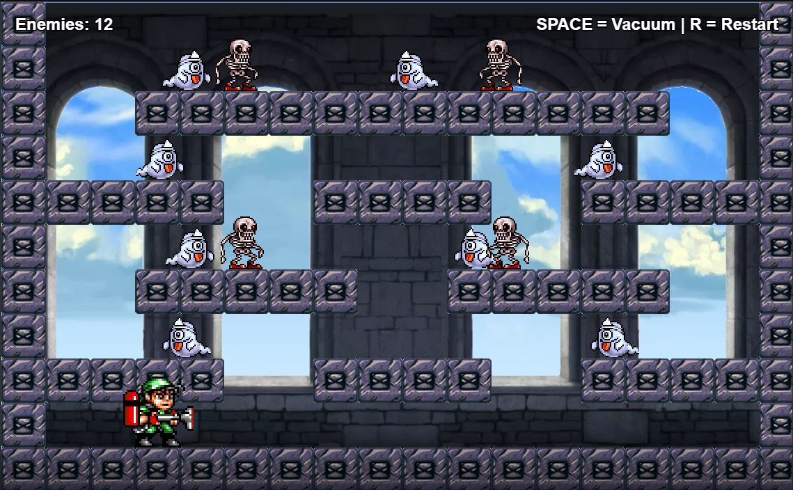

# Tumble Pop

A 2D arcade-style game built in C++, featuring custom sprite-based characters, animation, and sound.

## About

Tumble Pop is a 2D platformer in which the player explores a multi-level platform layout populated by patrolling ghosts and jumping skeletons. The player's goal is to capture every enemy on the level using a vacuum tool before being caught.

Core mechanics:
- The player moves left and right and jumps between platforms, with gravity and collision against blocks.
- Holding the vacuum (Space) activates a suction tool that pulls in any ghost or skeleton within range, deactivating them on contact.
- Ghosts patrol their platform automatically, periodically pausing and changing direction.
- Skeletons patrol and jump at random intervals, applying their own gravity and ground checks.

Win condition: All ghosts and skeletons on the level have been captured by the vacuum, triggering a "YOU WIN" screen.

Loss condition: Touching an active ghost or skeleton ends the run and triggers a "GAME OVER" screen.

Press Escape at any time to close the game.

## Features

- Custom sprite-based characters and objects
- Smooth 2D animation and movement
- Background music and sound effects
- Simple, intuitive controls
- Classic arcade-style gameplay

## Preview



> A quick look at Tumble Pop in action.

## Built With

- C++ — core game logic
- SFML (or other graphics/audio library) — rendering and sprite handling. Update with whichever library you are using.

## Project Structure

```
Tumble-Pop/
├── code.cpp          Main game source code
├── web_code.html     Website Version   
├── Data/              Game assets (sprites, audio)
│   ├── player.png
│   ├── player1.png
│   ├── ghostk.png
│   ├── skeletion.png
│   ├── vaccum.png
│   ├── block1.png
│   ├── bag.png
│   ├── bg.png
│   └── mus.ogg
└── Material/        Project files
```

## Getting Started

## Prerequisites

* A C++ compiler (e.g. g++, MSVC, Clang)
* [SFML](https://www.sfml-dev.org/) (Simple and Fast Multimedia Library) specifically:
  * `SFML/Graphics.hpp`
  * `SFML/Audio.hpp`
  * `SFML/Window.hpp`
* CMake (optional, if you're using it to build) or manual g++ linking

### Build and Run

```bash
g++ code.cpp -o TumblePop -lsfml-graphics -lsfml-window -lsfml-system -lsfml-audio
./TumblePop
```

Update the build command above to match your actual compiler setup and linked libraries.

## Controls

| Key          | Action                  |
|--------------|-------------------------|
| Left Arrow   | Move left               |
| Right Arrow  | Move right               |
| Up Arrow     | Jump                    |
| Space        | Activate vacuum (capture enemies in range) |
| Escape       | Quit the game            |

## License

Feel free to use and modify it.
